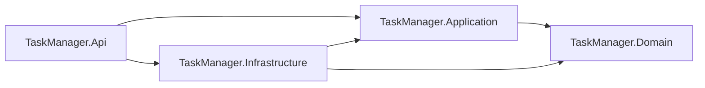
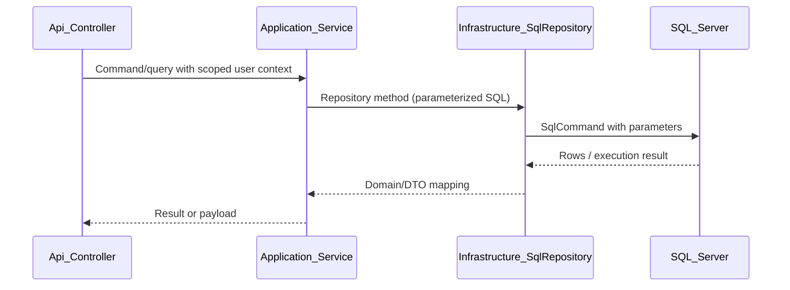
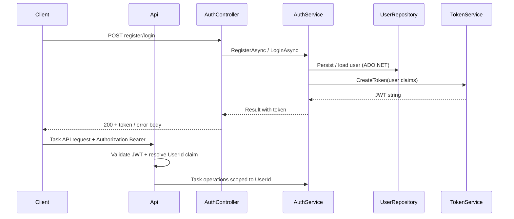
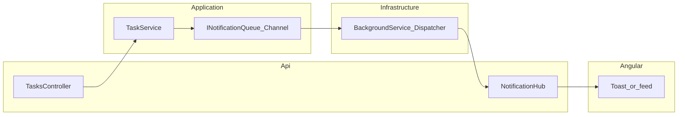

# Architecture

## Overview

The project follows **Clean Architecture** with explicit separation between HTTP/API concerns, application business logic, domain concepts, and infrastructure (SQL Server access, auth token/password primitives, and eventual real-time notification plumbing).

This document distinguishes **what exists in code today** from **what is planned** so it does not overstate implementation status.

---

## Current implementation status

| Area | Status | Notes |
|------|--------|--------|
| Solution layout (`Domain`, `Application`, `Infrastructure`, `Api`, tests) | **Implemented** | Projects exist; Api hosts composition root, JWT bearer + initializer + minimal `/` probe until controllers ship. |
| **Domain** (entities, enums) | **Implemented** | `User`, `TaskItem`, `Notification`, `TaskItemStatus`, `NotificationType`. |
| **Application** (services, DTOs, contracts, `Result`) | **Implemented** | `AuthService`, `TaskService`, repository/auth abstractions; unit tests cover core rules with mocks. |
| **Infrastructure** (ADO.NET, repositories, DB initializer, seed, hashing, JWT issuance) | **Implemented** | `SqlConnectionFactory`, `UserRepository`, `TaskRepository`, `NotificationRepository`, `DatabaseInitializer` (schema + demo seed), `PasswordHasher` (BCrypt), `JwtTokenService` (HS256). Registered via `AddInfrastructure`. |
| **API** (controllers, middleware, FluentValidation) | **Partial** | Host wires DI, **JWT bearer authentication**, runs DB initializer on startup, exposes a minimal `/` probe only — **no** auth/task controllers or FluentValidation yet. |
| **JWT authentication** | **Partial** | ASP.NET JWT bearer validation configured; `ITokenService` issues tokens — **no** register/login HTTP endpoints until API controllers land. |
| **Angular frontend** | **Planned** | Frontend folder placeholder only; SPA not scaffolded yet. |
| **`SignalR` + `BackgroundService` + `Channel<T>`** | **Planned** | Deferred until **core green** per project rules; not implemented yet. |
| Unit tests (Application) | **Implemented** | Eight tests targeting `AuthService` / `TaskService`. |
| Integration tests (`WebApplicationFactory`) | **Planned** | Project exists; tests not written yet. |

---

## Layers (target shape)

- **`TaskManager.Domain`:** Entities, enums, and simple domain rules.
- **`TaskManager.Application`:** Use cases, service implementations against interfaces, DTOs, repository/token/password contracts, validation-friendly results (`Result`).
- **`TaskManager.Infrastructure`:** ADO.NET (`Microsoft.Data.SqlClient`), connection factory, repository implementations, password hashing and JWT token issuance **implementations**, database initializer and seed data.
- **`TaskManager.Api`:** Controllers, middleware (exception handling, correlation ID), authentication/authorization configuration, SignalR hub mapping (when implemented), composition root (DI registration).

---

## Dependency direction

---

## Data access (planned flow)

**Status: planned** — repositories are defined as interfaces in Application; SQL implementations belong in Infrastructure.

**Rules:**

- Use **parameterized** ADO.NET exclusively in Infrastructure (no dynamic SQL built from raw user strings).
- Task reads/writes/deletes must filter by **`UserId`** derived from authenticated identity for protected operations.

---

## Authentication flow (planned)

**Status: planned** — JWT bearer scheme and ASP.NET Identity–free custom auth (users stored in SQL).

**Validation when implemented:**

- Unauthorized requests to protected routes return **401**.
- Token carries a stable **user identifier** used everywhere tasks are scoped.

---

## Notification flow (planned)

**Status: planned** — starts only after **core green** (working CRUD + JWT + tests + README baseline).

**Intent:**

1. Task mutation completes and persists.
2. A notification message is enqueued (in-memory `Channel<T>`).
3. A **BackgroundService** consumes the queue and pushes to the correct SignalR connection/group for the user.
4. Angular displays toast/history.

---

## Data access constraint (assignment)

The exercise forbids Entity Framework, Dapper, and Mediator/MediatR. Persistence uses **plain ADO.NET** with parameterized SQL in **`TaskManager.Infrastructure`** once implemented.

---

## Core green definition

The core is considered green when:

- Backend solution builds successfully.
- SQL Server runs through Docker Compose.
- Database initializer creates schema and seed/demo data.
- Register and login work.
- JWT protects task endpoints.
- Task CRUD works.
- Task operations are always scoped by authenticated `UserId`.
- Main unit tests pass.
- Main integration tests pass.
- README has minimum run instructions.

SignalR, background processing, and notification history start only after the core green checklist is complete.
