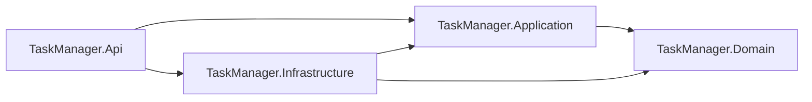

# Architecture

## Overview

The project follows Clean Architecture with explicit separation between HTTP concerns, application business logic, domain concepts, and infrastructure details.

## Layers

- `TaskManager.Domain`: entities, enums, and domain rules.
- `TaskManager.Application`: use cases, service contracts, DTOs, repository contracts, and business rules.
- `TaskManager.Infrastructure`: ADO.NET repositories, SQL Server access, authentication infrastructure, and database initialization.
- `TaskManager.Api`: controllers, middleware, authentication setup, request/response models, and composition root.

## Dependency Direction

## Data Access

The exercise forbids Entity Framework, Dapper, and Mediator/MediatR. Data access will use plain ADO.NET with parameterized SQL through repository implementations in `TaskManager.Infrastructure`.

## Core Green Definition

The core is considered green when:

- Backend solution builds successfully.
- SQL Server runs through Docker Compose.
- Database initializer creates schema and seed/demo data.
- Register and login work.
- JWT protects task endpoints.
- Task CRUD works.
- Task operations are always scoped by authenticated `UserId`.
- Main unit tests pass.
- Main integration tests pass.
- README has minimum run instructions.

SignalR, background processing, and notification history start only after the core green checklist is complete.
