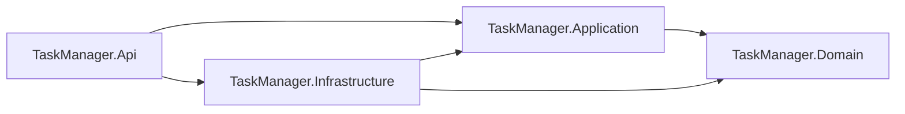
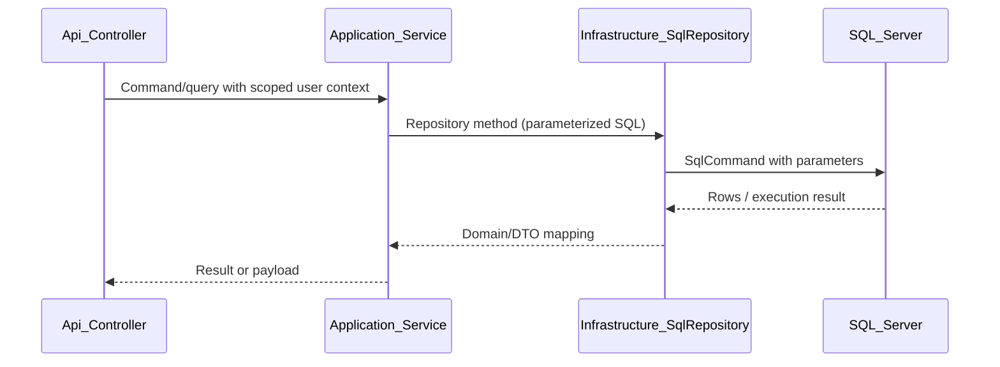
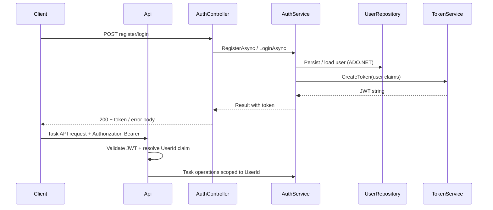
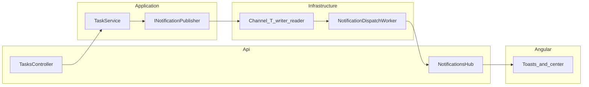

# Architecture

## Overview

The project follows **Clean Architecture** with explicit separation between HTTP/API concerns, application business logic, domain concepts, and infrastructure (SQL Server access, auth token/password primitives, and **real-time notifications** via SignalR + background dispatch).

This document emphasizes **what exists in code today**. Any **optional future** enhancements (CI, durable queues, etc.) live in presentation/design notes—not as “not yet built” features for items already shipped here.

---

## Current implementation status

| Area | Status | Notes |
|------|--------|--------|
| Solution layout (`Domain`, `Application`, `Infrastructure`, `Api`, tests) | **Implemented** | Api hosts composition root, JWT, initializer, REST controllers, middleware, and CORS. |
| **Domain** (entities, enums) | **Implemented** | `User`, `TaskItem`, `Notification`, `TaskItemStatus`, `NotificationType`. |
| **Application** (services, DTOs, contracts, `Result`) | **Implemented** | `AuthService`, `TaskService`, repository/auth abstractions; unit tests cover core rules with mocks. |
| **Infrastructure** (ADO.NET, repositories, DB initializer, seed, hashing, JWT issuance) | **Implemented** | `SqlConnectionFactory`, `UserRepository`, `TaskRepository`, `NotificationRepository`, `DatabaseInitializer` (schema + demo seed), `PasswordHasher` (BCrypt), `JwtTokenService` (HS256). Registered via `AddInfrastructure`. |
| **API** (controllers, FluentValidation, middleware) | **Implemented** | `AuthController`, `TasksController`, `NotificationsController`, `HealthController`; correlation + exception middleware; CORS policy `AngularDev` for Angular dev server; JWT on task and notification routes. |
| **JWT authentication** | **Implemented** | Bearer validation + token issuance; HTTP login/register expose JWT to clients. |
| **Angular frontend** | **Implemented** | SPA in `frontend/task-manager-web`: auth, task CRUD, SignalR client, toasts, notification center (drawer). |
| **`SignalR` + `BackgroundService` + `Channel<T>`** | **Implemented** | Notifications hub, JWT via `access_token` query on negotiate; worker dispatches after task mutations; SQL persistence. |
| Unit tests (Application) | **Implemented** | Ten tests targeting `AuthService` / `TaskService` (including task list paging, search length guard). |
| Integration tests (`WebApplicationFactory`) | **Implemented** | **Twenty-three** tests: health, auth, tasks (including user isolation, **list filter + pagination + sort + search**), notifications (list, async persistence after task create, **mark-read**, **unauthorized clear**, **clear-all**). |

---

## Layers (target shape)

- **`TaskManager.Domain`:** Entities, enums, and simple domain rules.
- **`TaskManager.Application`:** Use cases, service implementations against interfaces, DTOs, repository/token/password contracts, validation-friendly results (`Result`).
- **`TaskManager.Infrastructure`:** ADO.NET (`Microsoft.Data.SqlClient`), connection factory, repository implementations, password hashing and JWT token issuance **implementations**, database initializer and seed data.
- **`TaskManager.Api`:** Controllers, middleware (exception handling, correlation ID), authentication/authorization configuration, **SignalR hub mapping** (`/hubs/notifications`), composition root (DI registration).

---

## Dependency direction

---

## Data access (implemented flow)

**Status: implemented** — repositories in Infrastructure use parameterized ADO.NET against SQL Server (see `TaskManager.Infrastructure.Persistence`).

**Rules:**

- Use **parameterized** ADO.NET exclusively in Infrastructure (no dynamic SQL built from raw user strings).
- Task reads/writes/deletes must filter by **`UserId`** derived from authenticated identity for protected operations.

---

## Authentication flow

**Status: implemented** — register/login HTTP endpoints issue JWTs; task routes require `Authorization: Bearer`.

**Validated behavior (integration tests + manual API checks):**

- Unauthorized requests to protected routes return **401**.
- Token carries a stable **user identifier** used everywhere tasks and notifications are scoped.

---

## Notification flow (implemented)

**Status: implemented** — On task create/update/delete, `TaskService` calls **`INotificationPublisher`**, which enqueues a **`NotificationDispatchRequest`** onto an in-memory **`Channel<T>`**. A **`BackgroundService`** (`NotificationDispatchWorker`) reads from the channel, **persists** the notification via **`INotificationRepository`**, and pushes the payload to the user over **SignalR** (`NotificationsHub`). The Angular client shows **toasts** and merges realtime payloads into the **notification center** backed by **`GET /api/notifications`**.

Additional **HTTP** behavior (see `NotificationsController` / `NotificationRepository`):

- **`GET /api/notifications`** returns the user’s notifications (newest first). Before the query, the repository **deletes** rows older than **30 days** (UTC) for that user.
- **`POST /api/notifications/mark-read`** persists read state.
- **`DELETE /api/notifications`** removes **all** notifications for the user (**`204 No Content`**).

**Intent:**

1. Task mutation completes and persists.
2. Application code publishes work through **`INotificationPublisher`** (backed by **`Channel<T>`** in Infrastructure).
3. A **BackgroundService** consumes the queue, writes SQL, and pushes to the correct SignalR group for the user.
4. Angular displays **toasts** and a **notification center** (recent items from the API + realtime merge); **Clear all** calls **`DELETE /api/notifications`**.

---

## Data access constraint (assignment)

The exercise forbids Entity Framework, Dapper, and Mediator/MediatR. Persistence uses **plain ADO.NET** with parameterized SQL in **`TaskManager.Infrastructure`**.

---

## Core green definition

The core is considered green when:

- Backend solution builds successfully.
- SQL Server runs through Docker Compose.
- Database initializer creates schema and seed/demo data.
- Register and login work.
- JWT protects task endpoints.
- Task CRUD works.
- Task operations are always scoped by authenticated `UserId`.
- Main unit tests pass.
- Main integration tests pass.
- README has minimum run instructions.

SignalR, background processing, and notification history were introduced **after** the core green checklist; that ordering is preserved in the development log.
